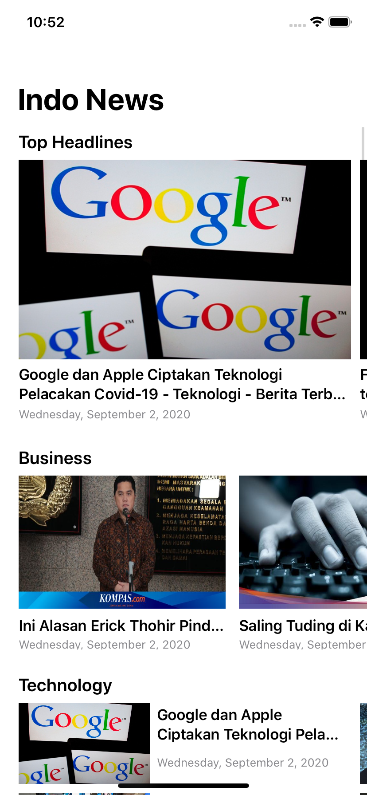
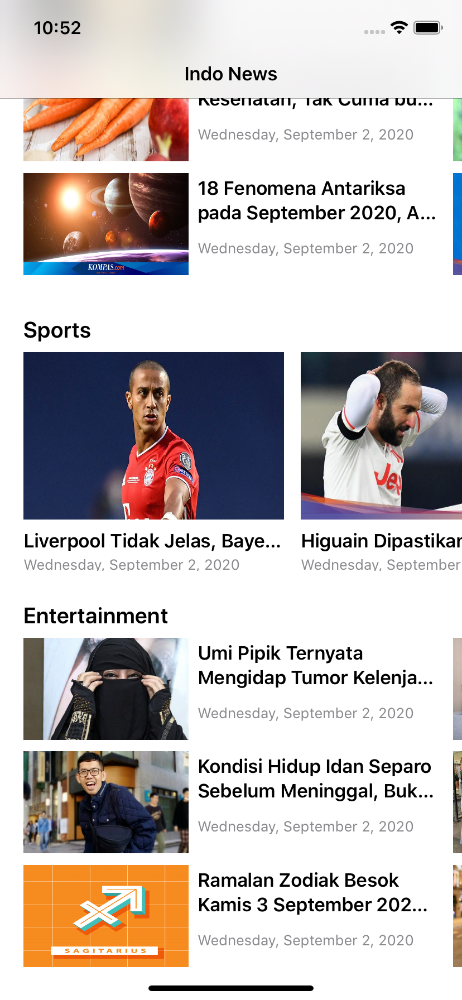

# NewsApp
News App build with UICollectionViewDiffableDataSource and UICollectionViewCompositionalLayout, with MVVM Architecture, Combine Framework and API Networking.

## How to run
Generate your own api key in https://newsapi.org. You just need to register and api key will generate to you. Go to **Networking class** and input your own api key here. <br>
```static let API_KEY: String = "YOUR_API_KEY"```


## Story and Overview
I've been learning SwiftUI for a while and I know that SwiftUI is using MVVM design pattern. From my perspective MVVM is pretty clean architecture and that makes me interested how I can implement MVVM in UIkit. That's why I make this app as my project in NC3. I'm also learning and interested about combine framework, in that project I'll try to create data binding with this framework. This app is using API from https://newsapi.org to get the live data. Trying to implement MVVM Architecture in UIKit is a bit challenging, that also the reason why I want to learn this.

## Screenshot
   . 

## MVVM Architecture
MVVM Architecture is one of famous design pattern that developer use. Basicly the MVVM Architecture is consist of 3 components which are **Model**, **View**, and **ViewModel**. Couple reason why I like this pattern is the separation of logic and view is very clear and easy to read.  

  
  
  ### Model
  Model(M) is a structure that we use as our data model
  ### View 
  View(V) is contains our View/UI logic, there is no business logic here because the data is coming from our ViewModel.
  ### ViewModel
  ViewModel(VM) is where all the fun is start, ViewModel contains all data which is needed in our view and contains logics that we use in our application
  
 ## Frameworks
 This app is only built by native iOS frameworks. I'm always trying to use native frameworks until it gets really complicated then I will look for 3rd party.
  
### UICollectionViewCompositionalLayout
UICollectionViewCompositionalLayout is really saved my day because it's really powerful to create a complex UI. It is new API that introduce in WWDC 2019 and it supports iOS 12++. It's really painful when start to learn this new API, but after throught painful process, this API this save your day. I'm also using UICollectionViewDiffableDataSource which is also new API that introduce last year.

### UICollectionViewDiffableDataSource
When using the traditional datasource is really annoyed when you need to specify the rows or section and I often forget to reload the data. That's one of the reason why I use this new API. One of the powerful feature from this API is free animations :v.

### Combine
I'm using Combine framework to create the data binding in my UIKit. It's really complicated to understand this framework but it is really fun.

 ## Source
 MVVM Pattern<br>
 https://benoitpasquier.com/ios-swift-mvvm-pattern/<br>
 Compositional Layout<br>
 https://www.youtube.com/watch?v=y1uXXVUu43o&t=682s<br>
 https://www.youtube.com/watch?v=hHQgHS7NHso<br>
 Diffable Data Source<br>
 https://www.youtube.com/watch?v=o6hUFEXkf9w&t=981s
 
